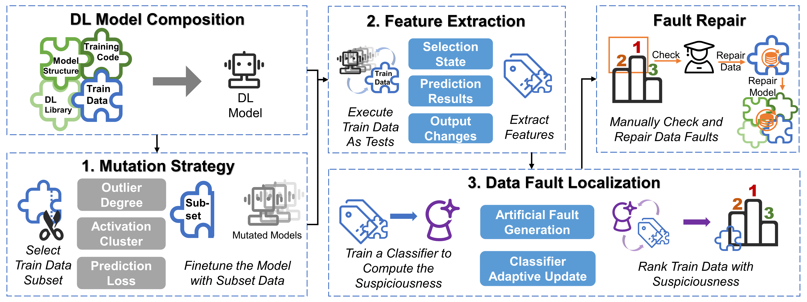
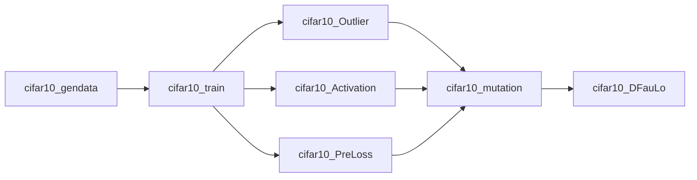

# DataDebugging
 
## Sequence of code execution in the repository

## Installation
`pip install -r requirements.txt`

## Usage
We prepare a demo for DFauLo:
+ `python demo.py`

You should first prepare the **MNIST** dataset classified in the following format and save it in the **demodata** folder:

```
MNIST
|-- train
    |-- 0
        |-- XX.png
        |-- XX.png
        |-- ...
    |-- 1
        |-- XX.png
        |-- XX.png
        |-- ...
    |-- ...
```


