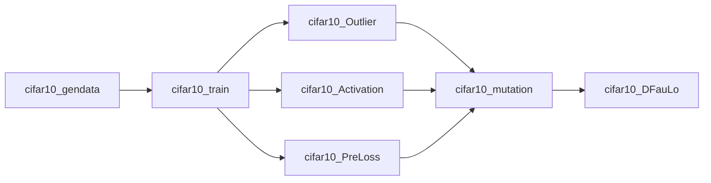

# DataDebugging
### 0.Program execution example

```mermaid
graph LR
cifar10_gendata --> cifar10_train;
cifar10_train --> cifar10_Outlier;
cifar10_train --> cifar10_Activation;
cifar10_train --> cifar10_PreLoss;
cifar10_Outlier --> cifar10_mutation;
cifar10_Activation --> cifar10_mutation;
cifar10_PreLoss --> cifar10_mutation;
cifar10_mutation --> cifar10_DFauLo;
```

