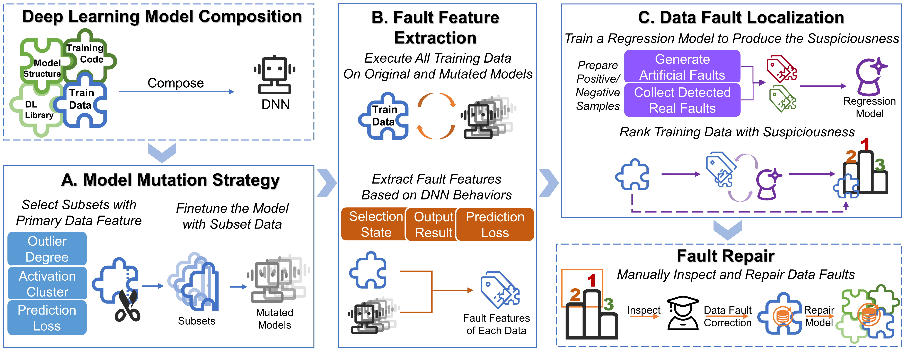

# DFauLo 
This repository is an implementation of the paper: **Data Fault Localization for Deep Learning Dataset**

 

[comment]: <> (## Sequence of code execution in the repository)

[comment]: <> (```mermaid)

[comment]: <> (graph LR)

[comment]: <> (cifar10_gendata --> cifar10_train;)

[comment]: <> (cifar10_train --> cifar10_Outlier;)

[comment]: <> (cifar10_train --> cifar10_Activation;)

[comment]: <> (cifar10_train --> cifar10_PreLoss;)

[comment]: <> (cifar10_Outlier --> cifar10_mutation;)

[comment]: <> (cifar10_Activation --> cifar10_mutation;)

[comment]: <> (cifar10_PreLoss --> cifar10_mutation;)

[comment]: <> (cifar10_mutation --> cifar10_DFauLo;)

[comment]: <> (```)
## Installation
`pip install -r requirements.txt`

## Usage
We prepare a demo for DFauLo:
+ `python demo.py`

You should first prepare the **MNIST** dataset classified in the following format and save it in the **demodata** folder:

```
MNIST
|-- train
    |-- 0
        |-- XX.png
        |-- XX.png
        |-- ...
    |-- 1
        |-- XX.png
        |-- XX.png
        |-- ...
    |-- ...
```
Some `demo.py` results are shown below:


<div><table frame=void>	<!--用了<div>进行封装-->
	<tr>
        <td><div><center>	<!--每个格子内是图片加标题-->
        		<!--高度设置-->
        	<br>	<!--换行-->
        	label: 4	<!--标题1-->
        </center></div></td>    
     	<td><div><center>	<!--第二张图片-->
    			
    		<br>
    		label: 7
        </center></div></td>
        <td><div><center>	<!--每个格子内是图片加标题-->
        		<!--高度设置-->
        	<br>	<!--换行-->
        	label: 6	<!--标题1-->
        </center></div></td> 
        <td><div><center>	<!--每个格子内是图片加标题-->
        		<!--高度设置-->
        	<br>	<!--换行-->
        	label: 7	<!--标题1-->
        </center></div></td> 
        <td><div><center>	<!--每个格子内是图片加标题-->
        		<!--高度设置-->
        	<br>	<!--换行-->
        	label: 1	<!--标题1-->
        </center></div></td> 
	</tr>
</table></div>

**You can modify the code in the `demo.py` to run DFauLo on any dataset.**


