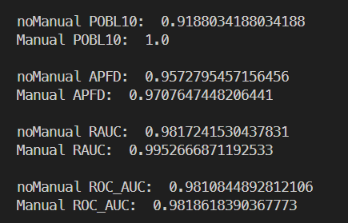
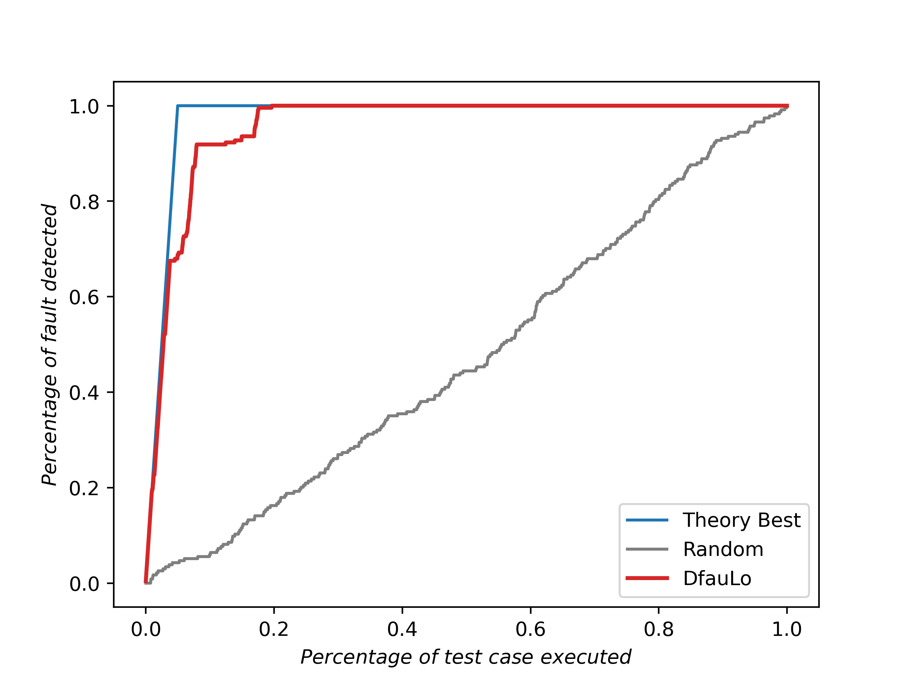
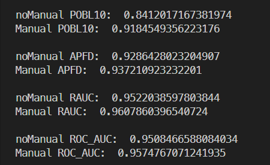
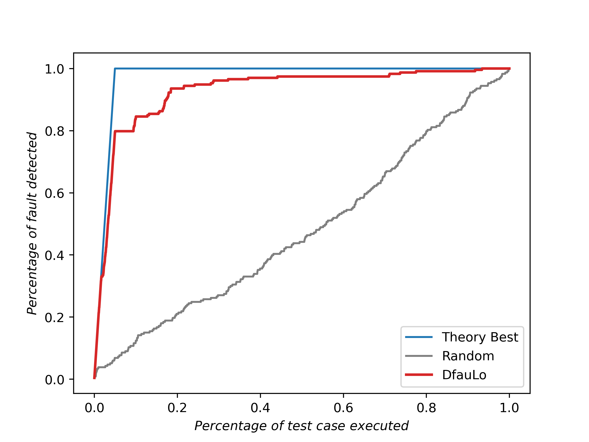
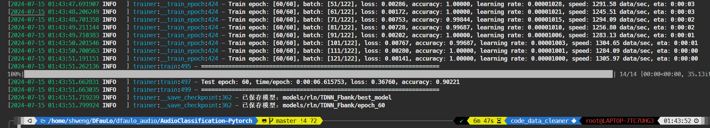

# 将Dfaulo用于Audio分类问题

## MAD js数据集适配：

### 训练模型

`python train.py`

RandomLabelNoise训练结果:

`Test epoch: 60, time/epoch: 0:00:04.075886, loss: 0.35070, accuracy: 0.90315`

### 运行Dfaulo

#### 类别缺陷：

`python exp_effective.py`

结果（项目指标即下图中的RAUC值）：

RAUC曲线：

#### 噪声缺陷:

`python exp_effective_noise.py`

RAUC曲线：

时间效率：

dfaulo time:  {'Select Subset': 45.52100992202759, 'Mutation&Extraction': 63.106096267700195, 'Initialize Susp': 0.09430122375488281, 'Update Susp': 0.02017354965209961, 'all': 108.74158096313477}

$ \frac{108s}{4686} = 23ms/it$

## UrbanSound8k数据集适配：
先下载数据：

链接：https://pan.baidu.com/s/1gTXwV2llGIgVU6PvxtcMaw?pwd=dfad 
提取码：dfad 

运行`python exp_effective.py`

或者：
+ `python dfaulo.py --dataset './AudioClassification-Pytorch/dataset/train_rln' --model './AudioClassification-Pytorch/models/rln/TDNN_Fbank/last_model/model.pth' --model_name 'TDNN' --class_path './AudioClassification-Pytorch/dataset/classes.json' --image_size -1 --model_args None --image_set 'train' --hook_layer 'bn6' --rm_ratio 0.05 --retrain_epoch 10 --retrain_bs 64`

运行结果：

## *脏模型训练流程：

### 1. 缺陷生成
`audio_fault_gen.py`用于生成缺陷，现支持5%的RandomLabelNoise，以下用rln表示。

### 2. 训练Audio分类模型：

请先阅读AudioClassification-Pytorch的README。

正确设置`tdnn_fea_extra.yml`并改变`extract_features.py`中对应参数，然后运行，以提取特征。

提取完后得到文件:
- `dataset/features_rln/` 存放用于训练的特征
- `dataset/train_list_rln_features.txt`
- `dataset/test_list_features.txt`

训练得到缺陷模型

`python train.py`

